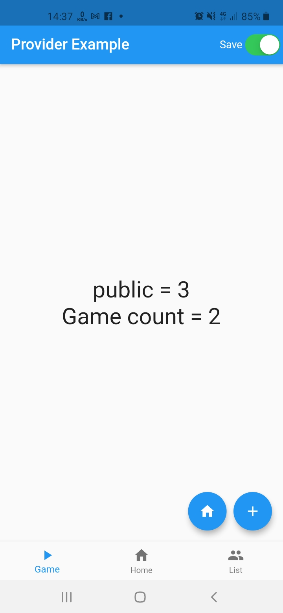
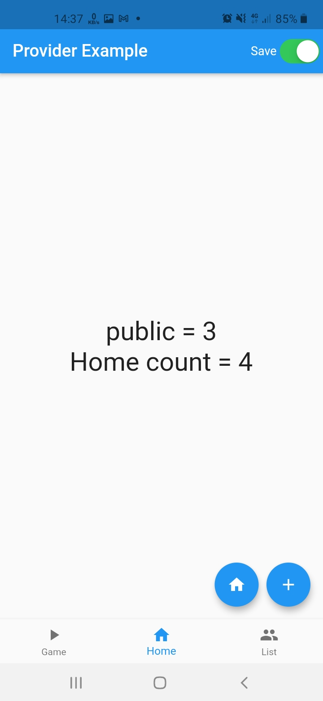

# Provider Example
## Ishlatilgan texnalogiyalar
1. Provider          - Arxitektura uchun
2. BottomNavigation  - Bottom menu 
3. IndexedStack      - Menudagi screen statelarini saqlab qolish uchun

## Dastur sxemasi

## Dasturdan screenlar

## Dasturni ishlatib ko'rish
[apk](https://raw.githubusercontent.com/abbos2101/provider_example_bottom_navigation_app/master/github_files/app.apk)

### Bog'lanish uchun
[Telegram](https://t.me/abbos2101)
[Facebook](https://www.facebook.com/abbos.bobomurodov.2101)
